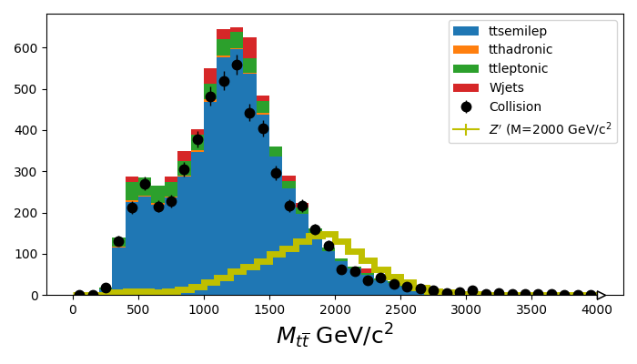

# Search for Resonant Z' Production in Proton-Proton Collisions with the CMS Detector Using Open Data CERN

This project was developed during the CMS Open Data Workshop & Hackathon 2024. During the hackathon, I chose the machine learning applications in high-energy physics section and developed an autoencoder for anomaly detection, with a focus on identifying the Z' signal.

## Table of Contents
- [Justification](#justification)
- [Hypothesis](#hypothesis)
  - [Final State Physics Objects](#final-state-physics-objects)
  - [Background Processes](#background-processes)
  - [Analysis Procedure](#analysis-procedure)
    - [1. Data Extraction](#1-data-extraction)
    - [2. Data Selection](#2-data-selection)
    - [3. Modeling Backgrounds](#3-modeling-backgrounds)
    - [4. Pileup Correction](#4-pileup-correction)
    - [5. Hackathon](#5-hackathon)

## Justification
Over the past decades, various extensions of the Standard Model (SM) have been developed to address unresolved issues, such as the nature of dark matter. Theories beyond the Standard Model (BSM) predict the existence of new physical phenomena and often introduce new elementary particles. Many BSM scenarios introduce new gauge symmetries to elucidate the properties of the Standard Model. These models frequently predict a new heavy neutral gauge boson, referred to as the Z' boson, which can decay into pairs of light fermions or, in some cases, preferentially into pairs of top-antitop, as demonstrated in the leptophobic topcolor model.

## Hypothesis
We hypothesize the existence of a particle with specific properties, referred to as Z’, which is produced in proton-proton collisions and then decays into a top-antitop pair.

### Final State Physics Objects
- The jet coming from the b-quark of the leptonically-decaying top quark.
- The muon coming from the W of the leptonically-decaying top quark.
- The neutrino coming from the W of the leptonically-decaying top quark.
- The fully-merged jets of the hadronically-decaying top quark.

### Background Processes
- Production of a top-quark pair that decays semileptonically.
- Production of a top-quark pair that decays hadronically.
- Production of a top-quark pair that decays leptonically.
- Production of W bosons in association with jets and when the W bosons decay leptonically.

### Analysis Procedure

#### 1. Data Extraction
The data from the CMS experiment were extracted from the CERN Open Data portal (https://opendata.cern.ch/) and accessed using the uproot library. The datasets used were as follows:
- Collision (data):
  - `/SingleMuon/Run2016G-UL2016_MiniAODv2_NanoAODv9-v1/NANOAOD`
  - `/SingleMuon/Run2016H-UL2016_MiniAODv2_NanoAODv9-v1/NANOAOD`
- Signal MC dataset (M2000):
  - `/ZprimeToTT_M2000_W20_TuneCP2_PSweights_13TeV-madgraph-pythiaMLM-pythia8/RunIISummer20UL16NanoAODv9-106X_mcRun2_asymptotic_v17-v1/NANOAODSIM`
- Background MC datasets:
  - tt semileptonic:
    - `/TTToSemiLeptonic_TuneCP5_13TeV-powheg-pythia8/RunIISummer20UL16NanoAODv9-106X_mcRun2_asymptotic_v17-v1/NANOAODSIM`
  - tt hadronic:
    - `/TTToHadronic_TuneCP5_13TeV-powheg-pythia8/RunIISummer20UL16NanoAODv9-106X_mcRun2_asymptotic_v17-v1/NANOAODSIM`
  - tt leptonic:
    - `/TTTo2L2Nu_TuneCP5_13TeV-powheg-pythia8/RunIISummer20UL16NanoAODv9-106X_mcRun2_asymptotic_v17-v1/NANOAODSIM`
  - W jets:
    - `/WJetsToLNu_TuneCP5_13TeV-madgraphMLM-pythia8/RunIISummer20UL16NanoAODv9-106X_mcRun2_asymptotic_v17-v1/NANOAODSIM`

#### 2. Data Selection
A DataFrame is created containing the selected events and the calculated variables based on the following criteria:
- Muon physics object with \( pt > 55 \) GeV/c and \( |η| < 2.4 \).
- Merged jets (using the FatJet object) with \( pt > 500 \) GeV/c.
- Neutrino (using missing energy in the transverse plane) with MET > 50 GeV/c, approximated with PuppiMET object and mass set to 0.
- Jets with b-tagging score > 0.5 and jet identification score ≥ 4.
- The events must pass the HLT_TkMu50 trigger, which requires a track consistent with a muon with \( pt > 50 \) GeV/c.
- For real data, a mask is applied using a JSON file (Cert_271036-284044_13TeV_Legacy2016_Collisions16_JSON.txt) containing luminosity information, ensuring that only “good” runs are used for processing collision data.

#### 3. Modeling Backgrounds
Standard Model processes can produce the same final state objects and mimic the Z' signal. Selection criteria have been chosen to ensure different kinematics from the signal, but it is not possible to completely eliminate all Standard Model processes. Therefore, an estimate is needed for how much of the remaining collision data can be explained by these background processes. Essentially, simulation datasets modeling the backgrounds will be utilized. All these contributions are summed to check if there is an excess that could be explained by the signal hypothesis, in this case, Z'.

To estimate the background contribution, the weight of each event was calculated using the equation:

In this context, the number of generated events was obtained for each signal and background dataset. The integrated luminosity was assumed to be 16,400 inverse picobarns, and the cross sections were defined as follows:
- Top-antitop (ttbar): 831.76 pb.
- Wjets: 61,526.7 pb.
- Ttsemilep: 43.8% of the ttbar cross section.
- Tthadronic: 45.7% of the ttbar cross section.
- Ttleptonic: 10.5% of the ttbar cross section.
- Signal_M2000 and collision dataset: assumed to be 1 pb.

Thus, the background datasets are stacked and plotted as a filled histogram. The collision datasets and the signal hypothesis are overlaid, creating a histogram of the invariant mass values of top-antitop pairs. This allows for a comparative visualization of the actual collision data, the simulated background data, and the simulated Z' signal.

As a result, it is observed that the signal exhibits a distinct peak compared to the background; however, no obvious signal is evident.

#### 4. Pileup Correction
Pileup refers to the number of simultaneous interactions in each beam crossing. This effect is modeled by Pythia based on measurements of the total cross-section for inelastic proton-proton scattering. Pileup corrections can be applied using correction files provided by CMS in JSON format.

In this analysis, the file muon_Z.json was used to apply corrections to the simulated Z' signal. Three types of pileup scale factors were calculated:
- Nominal: Standard correction.
- Up: Correction with upward systematic uncertainty.
- Down: Correction with downward systematic uncertainty.

Experimental uncertainties are typically provided as "up" and "down" adjustments to a parameter, assuming that these variations represent a shift of one standard deviation.

Using the calculated pileup scale factors, a histogram of the invariant mass distribution of top-antitop pairs was created. The plot illustrates the impact of pileup corrections on the invariant mass distribution.

Additionally, a histogram was created for the distribution of pileup values, demonstrating how pileup corrections affect the distribution.

#### 5. Hackathon
The goal of this analysis was to employ unsupervised machine learning techniques to identify anomalies in proton-proton collision data available on the CERN Open Data portal. To achieve this, an autoencoder (AE) model was implemented, trained exclusively on background data. The central premise is that highly anomalous events will not be accurately reconstructed by the AE, as it was trained only on background data.

The autoencoder model was trained to learn how to compress and decompress background data. After training, the model was evaluated using Z' signal data. The evaluation involved comparing the real data with the data reconstructed by the autoencoder.

The analysis of the mean squared error (MSE) was conducted to quantify the difference between the real data and the reconstructed data. It was expected that the MSE for the anomalous signal would be higher, indicating that anomalous events are less accurately reconstructed by the model since the autoencoder was trained exclusively with background data.

The results showed that the MSE for the anomalous signal (BSM) is, on average, higher than for the background, as expected. This confirms that the autoencoder has more difficulty reconstructing the Z' signal events, suggesting that these events are recognized as anomalous. The green line in the graph indicates that the MSE for the background is lower, confirming that the model accurately reconstructs the data it was trained on.

The difference in the MSE distributions between the background and the Z' signal demonstrates that the autoencoder is effective in identifying anomalies. The higher probability of elevated MSE for the anomalous signal suggests that these events are significantly different from the background events (Standard Model events).

The ROC curve was constructed by comparing the MSE distributions for the normal data (SM) and the anomalous data (BSM). This curve reflects the model's ability to correctly identify anomalous events based on an MSE threshold, as well as the fraction of normal events incorrectly classified as anomalous.

The ROC curve result was 93.5%, indicating a high capacity of the model to effectively identify anomalies. The ROC curve, which approaches the upper left corner of the graph, suggests a good separation between the two classes and a high AUC, confirming the effectiveness of the autoencoder in anomaly detection.

To optimize the model's performance and reduce computational complexity, quantization techniques were applied using the QKeras library, developed in collaboration between CERN and Google. The goal of quantization was to increase efficiency in both model training and inference. The quantized model trained with QKeras achieved an AUC of 93.5%, matching the performance of the non-quantized model.

## Author
This project was developed by Maria Gabriela Gomes. For more information or to connect, please visit my [LinkedIn profile](https://www.linkedin.com/in/maria-gabriela-gomes-27097431b?utm_source=share&utm_campaign=share_via&utm_content=profile&utm_medium=android_app).

